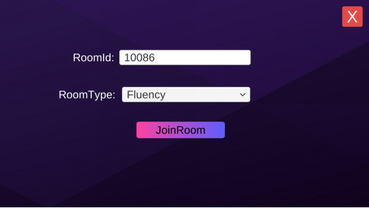
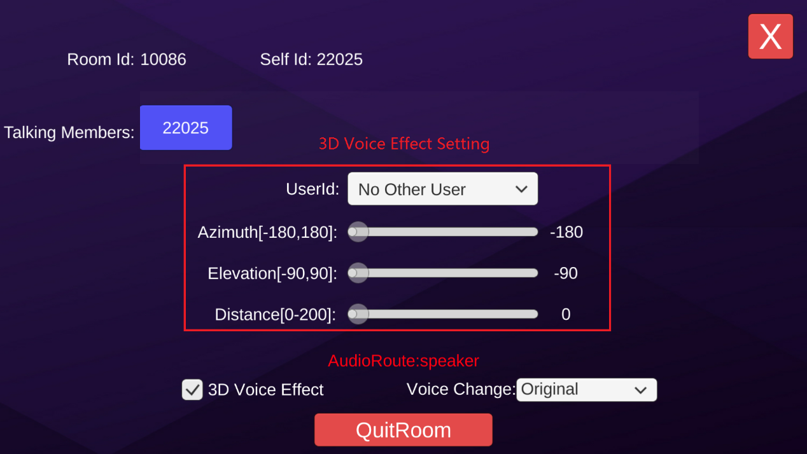
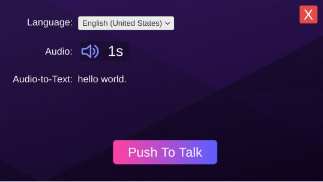

## 1.Login

> Figure 1 login interface

Click the "Login" button and you will be logged in with the set user id. After logged in, there will be two more buttons which are “Voice Chat” and “Voice Message”.

> Figure 2 mode selection interface

Click the “Voice Chat” button to activate the voice chat function. Click the “Voice Message” button to activate the voice message function.

## 2.Voice Chat
Click the "Voice Chat" button in Figure 2 to enter the following interface : 

> Figure 3 enters the room interface

Room Id: Members with the same room ID will enter the same room.

RoomType: Select voice quality:

- Fluency: Smooth priority, ultra-low latency real-time voice, applied in the game to open team voice chat scenes, suitable for FPS, MOBA and other types of games;

- Standard: The sound quality is good, the latency is medium, suitable for real-time call scenes of casual games such as table games, chess and so on;

- High Quality: Super-high sound quality, relatively high latency, suitable for music and dance games and voice social apps; suitable for playing music, online karaoke and other scenes with high sound quality requirements.

Click the "JoinRoom" button to enter the room.

> Figure 4 room interface

Talking Members：Show the members who are talking in the room.

3D Voice Effect: Switch for 3D voice. Show or hide the 3D voice settings interface.

Voice Change：Select voice font type. 10 kinds of voice font are supported.

3D Voice Effect setting:

- Userid: The user id expected to use 3D voice, you can select any speaking members except yourself in the room.

- Azimuth: The angle in the horizontal direction relative to yourself, which will be 0 at the front, 90 at the right, -90 at the left and 180 or -180 at the back.

- Elevation: The angle in the vertical direction relative to yourself. On a horizontal plane with yourself, the angle will be 0, directly below will be -90, and directly above will be 90.

- Distance: Relative distance from yourself.

## 3.Voice Message

Click the "Voice Message" button in Figure 2 to enter the voice message interface.

> Figure 5 voice message interface

Language: Language being used

Audio：Recorded voice messages and voice duration. Click  to play audio, and click it again to end playback.

Audio-to-Text：Text recognized from voice. Press and hold the “Push To Talk” button to record voice and release it to end recording.
