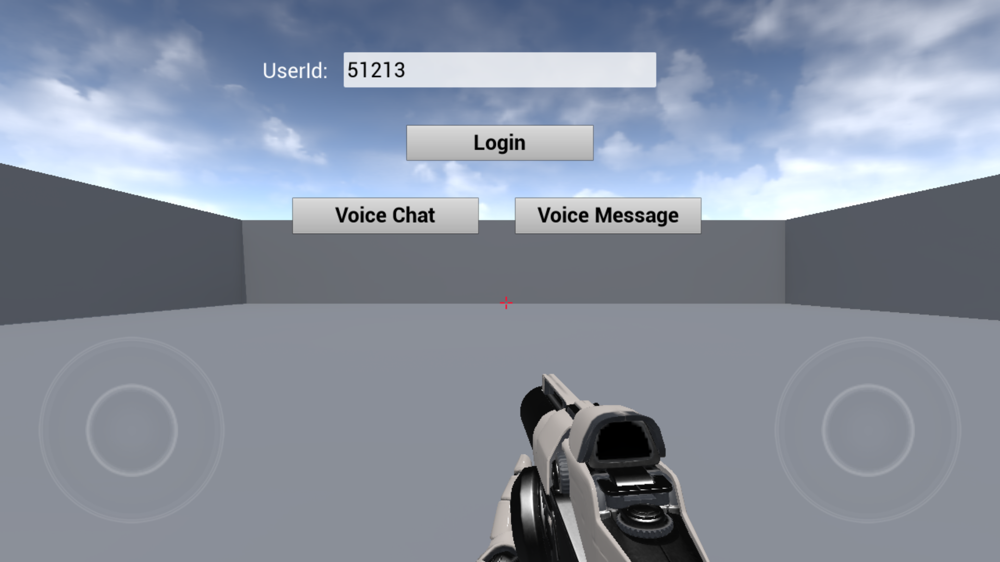

## 1.Login

> Figure 1 login interface

Click the "Login" button and you will be logged in with the set user id. After logged in, there will be two more buttons which are “Voice Chat” and “Voice Message”.

> Figure 2 mode selection interface

Click the “Voice Chat” button to activate the voice chat function. Click the “Voice Message” button to activate the voice message function.

## 2.Voice Chat
Click the "Voice Chat" button in Figure 2 to enter the following interface : 

> Figure 3 enters the room interface

Room Id: Members with the same room number will enter the same room.

RoomType: Select voice quality:

- Fluency: Smooth priority, ultra-low latency real-time voice, applied in the game to open team play scenes, suitable for FPS, MOBA and other types of games;

- Standard: The sound quality is good, the lag is moderate, suitable for real-time call scenes of casual games such as table games, chess and so on;

- Hign Quality: High sound quality, relatively laggy, suitable for music and dance games and voice social apps; suitable for playing music, online karaoke and other scenes with high sound quality requirements.

Click the "JoinRoom" button to enter the room,and click the “Back” button to Return to the previous interface.

> Figure 4 room interface

Mic: Turn on/off the microphone.

Spearker: Turn on/off the speaker.

Talking Members: Show the members who are talking in the room.

3D Voice Effect: Switch 3D voice and show or hide the 3D voice settings interface.

Voice Change: Select voice type. 10 kinds of voice type are supported.
The members in the room will appear in the scene as a actor. Moving around the members, you can experience the 3D sound effect.

## 3.Voice Message

Click the "Voice Message" button in Figure 2 to enter the voice message interface.

> Figure 5 voice message interface

Audio：Recorded voice messages and voice duration. Click  to play audio, and click it again to end playback.

Audio-to-Text：Text converted from audio.Press and hold the “Push To Talk” button to record voice and release it to end recording.Click the “Back” button to Return to the previous interface.