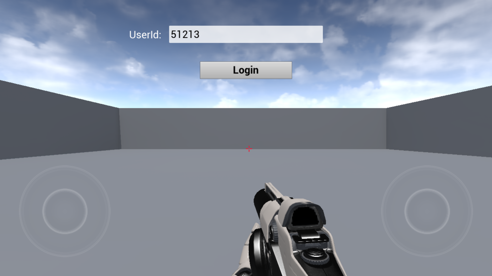
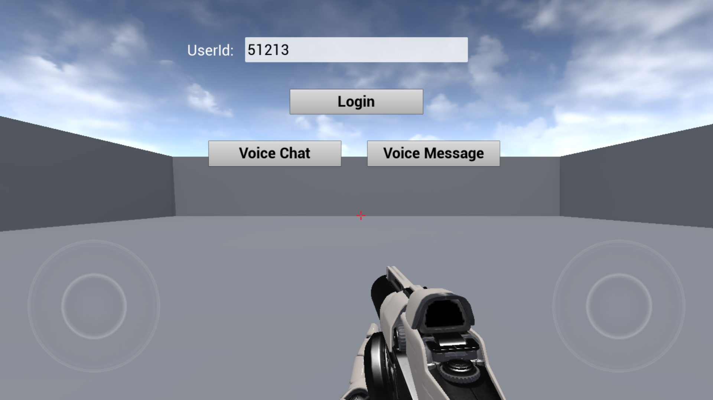
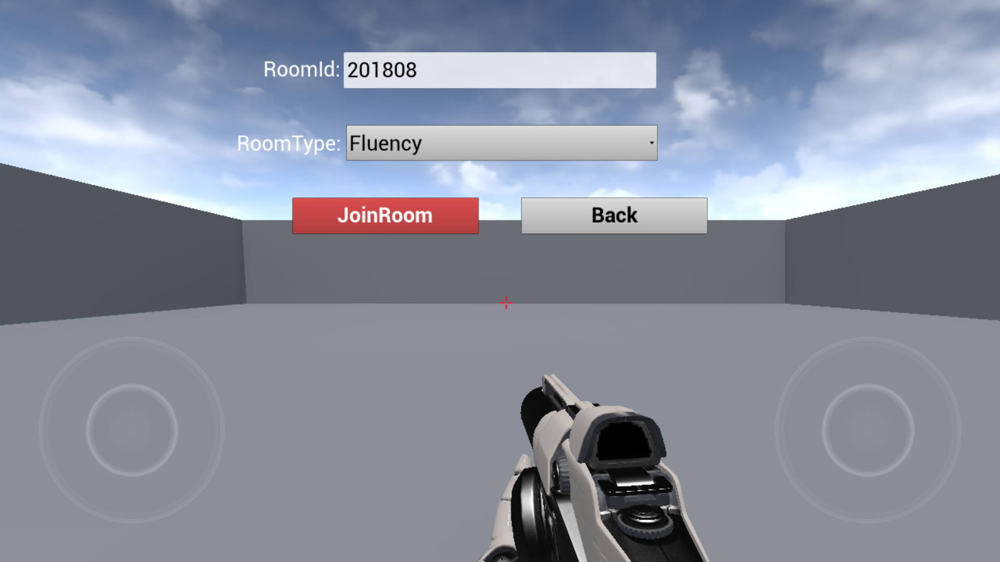
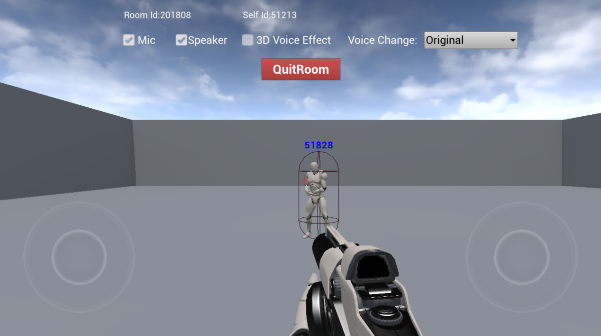
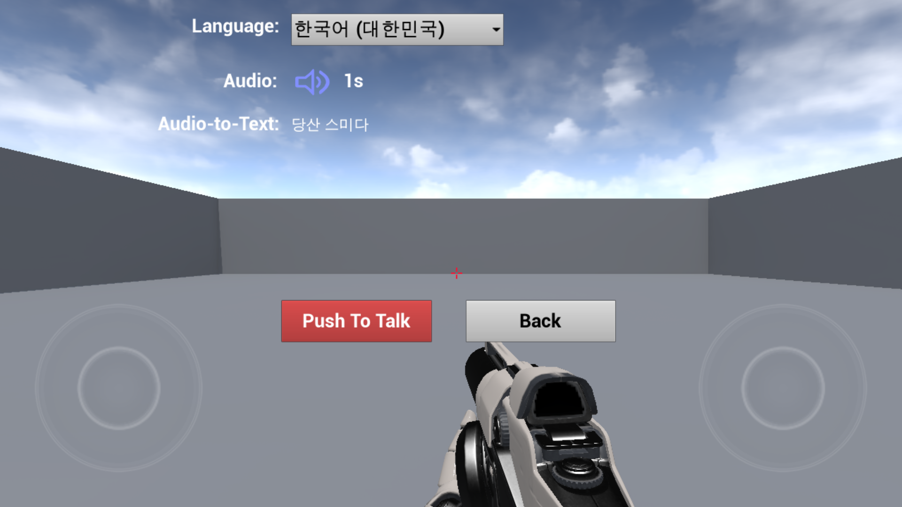

## 1.登录

> 图1 登录界面

点击“Login”按钮，就会使用设置的userid进行登录。登录后，界面会多出两个按钮，“Voice Chat”和“Voice Message”。

> 图2模式选择界面

点击“Voice Chat”按钮会进入语音聊天功能，点击“Voice Message”按钮会进入语音消息功能。

## 2.语音聊天
点击图2中的“Voice Chat”按钮，进入如下界面：

> 图3进房界面

Room Id：房间号相同的成员会进入同一个房间。

RoomType：控制语音质量：

- Fluency：流畅音质。流畅优先、超低延迟实时语音，应用在游戏内开黑场景，适用于FPS、MOBA等类型的游戏；

- Standard：标准音质。音质较好，延时适中，适用于狼人杀、棋牌等休闲游戏的实时通话场景；

- Hign Quality：高清音质。超高音质，延时相对大一些，适用于音乐舞蹈类游戏以及语音社交类APP；适用于播放音乐、线上K歌等有高音质要求的场景；

点击“JoinRoom”按钮 进入房间。

> 图4房间内界面

Mic：开关麦克风。

Speaker：开关扬声器。

3D Voice Effect：开关3D语音。

Voice Change：选择变声类型，支持10种变声效果。
房间内的成员会以小人的方式展现在场景内，在成员周围运动，可以体验3D音效。

## 2.语音消息

点击图2中的“Voice Message”按钮进入语音消息。

> 图5语音消息界面

Language：使用的语言

Audio：录制的语音消息和语音时长, 点击  播放录音，播放过程中再次点击，结束播放。

Audio-to-Text：语音转换成的文字，按住“Push To Talk”按钮，开始录制；松开此按钮，结束录制。