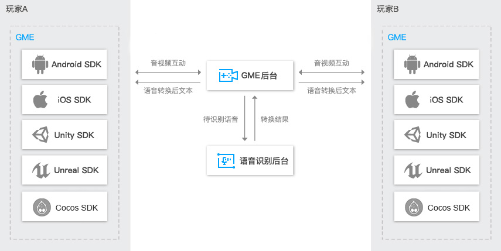

## GME
[游戏多媒体引擎](https://cloud.tencent.com/product/tmg?idx=1)（Game Multimedia Engine）是一个专门针对游戏场景定制的实时游戏音视频 SDK，覆盖了休闲社交类、MOBA 类、MMORPG 等多种游戏类型，提供了包括多人实时语音、实时视频、语音消息、语音转文本等功能。功能完备，接入门槛低，一个 SDK 即可满足多样化的游戏音视频诉求。

## 产品架构

## 接入通用文档

#### [接入指引文档](./GME%20Introduction.md)
#### [控制台用量统计文档](./GME%20Introduction.md#%E6%8E%A7%E5%88%B6%E5%8F%B0%E7%94%A8%E9%87%8F%E7%BB%9F%E8%AE%A1%E4%BD%BF%E7%94%A8)
#### [密钥技术文档](./GME%20Developer%20Manual/GME%20Key%20Manual.md)
#### [范围文档](./GME%20Developer%20Manual/GME%20TeamAudio%20Manual.md)
#### [3D音效文档](./GME%20Developer%20Manual/GME%20Spatializer%20Manual.md)
#### [错误码文档](./GME%20Developer%20Manual/GME%20Error%20Code.md)

## 各平台接入文档

#### Unity 引擎
- ##### *支持平台:Android, iOS, Windows, MAC*
- [Unity 工程配置文档](./GME%20Developer%20Manual/Unity%20Developer%20Manual/Unity%20SDK%20Project%20Configuration.md)
- [Unity 快速接入文档](./GME%20Developer%20Manual/Unity%20Developer%20Manual/Unity%20SDK%20Developer%20Quick%20Start.md)
- [Unity 开发接入技术文档](./GME%20Developer%20Manual/Unity%20Developer%20Manual/Unity%20SDK%20Developer%20Manual.md)

#### Unreal Engine 引擎
- ##### *支持平台:Android, iOS, Windows, MAC*
- [Unreal Engine 工程配置文档](./GME%20Developer%20Manual/Unreal%20Engine%20Developer%20Manual/Unreal%20Engine%20SDK%20Project%20Configuration.md)
- [Unreal Engine 快速接入文档](./GME%20Developer%20Manual/Unreal%20Engine%20Developer%20Manual/Unreal%20SDK%20Developer%20Quick%20Start.md)
- [Unreal Engine 开发接入技术文档](./GME%20Developer%20Manual/Unreal%20Engine%20Developer%20Manual/Unreal%20Engine%20SDK%20Developer%20Manual.md)

#### Cocos2D 引擎
- ##### *支持平台:Android, iOS*
- [Cocos2D-X 工程配置文档](./GME%20Developer%20Manual/Cocos2D-X%20Developer%20Manual/Cocos2d%20SDK%20Project%20Configuration.md)
- [Cocos2D-X 快速接入文档](./GME%20Developer%20Manual/Cocos2D-X%20Developer%20Manual/Cocos2d%20SDK%20Developer%20Quick%20Start.md)
- [Cocos2D-X 开发接入技术文档](./GME%20Developer%20Manual/Cocos2D-X%20Developer%20Manual/Cocos2d%20SDK%20Developer%20Manual.md)

#### 原生应用
- [Windows 工程配置文档](./GME%20Developer%20Manual/Windows%20Developer%20Manual/Windows%20SDK%20Project%20Configuration.md)

- [Windows 快速接入文档](./GME%20Developer%20Manual/Windows%20Developer%20Manual/Windows%20SDK%20Developer%20Quick%20Start.md)

- [Windows 开发接入技术文档](./GME%20Developer%20Manual/Windows%20Developer%20Manual/Windows%20SDK%20Developer%20Manual.md)

- [Mac 工程配置文档](./GME%20Developer%20Manual/Mac%20Developer%20Manual/Mac%20SDK%20Project%20Configuration.md)

- [Mac 快速接入文档](./GME%20Developer%20Manual/Mac%20Developer%20Manual/Mac%20SDK%20Developer%20Quick%20Start.md)

- [Mac 开发接入技术文档](./GME%20Developer%20Manual/Mac%20Developer%20Manual/Mac%20SDK%20Developer%20Manual.md)

- [iOS 工程配置文档](./GME%20Developer%20Manual/iOS%20Developer%20Manual/iOS%20SDK%20Project%20Configuration.md)

- [iOS 快速接入文档](./GME%20Developer%20Manual/iOS%20Developer%20Manual/iOS%20SDK%20Developer%20Quick%20Start.md)

- [iOS 开发接入技术文档](./GME%20Developer%20Manual/iOS%20Developer%20Manual/iOS%20SDK%20Developer%20Manual.md)

- [Android 工程配置文档](./GME%20Developer%20Manual/Android%20Developer%20Manual/Android%20SDK%20Project%20Configuration.md)

- [Android 快速接入文档](./GME%20Developer%20Manual/Android%20Developer%20Manual/Android%20SDK%20Developer%20Quick%20Start.md)

- [Android 开发接入技术文档](./GME%20Developer%20Manual/Android%20Developer%20Manual/Android%20SDK%20Developer%20Manual.md)

#### H5 接入
- [H5 工程配置文档](./GME%20Developer%20Manual/H5%20Developer%20Manual/H5%20SDK%20Project%20Configuration.md)

- [H5 开发接入文档](./GME%20Developer%20Manual/H5%20Developer%20Manual/H5%20SDK%20Developer%20Manual.md)

## SDK更新说明

参见[更新历史](./GME%20Developer%20Manual/GME%20Change%20History.md)

## 联系我们

邮箱：terryzuo@tencent.com;garyzeng@tencent.com;v_caisxcai@tencent.com

## Documentation

[GME Documentation(English)](./README_intl.md)
