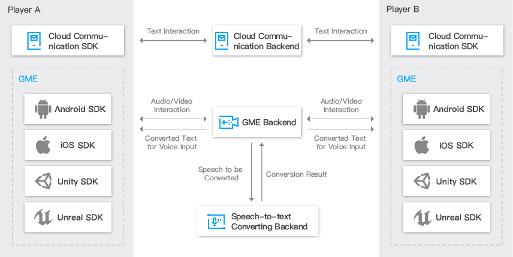

## GME
[Game Multimedia Engine ](https://cloud.tencent.com/product/tmg?idx=1)（GME） is a real-time game audio and video SDK that has been specifically customized for game scenes. It supports many types of games, including casual games MOBA and MMORPG. It also provides real-time multi-person voice chat, voice messages, speech-to-text conversion, and other features. With a complete set of features and a low access threshold, the demand for diverse mobile gaming scenes is met with just one SDK.

## Product Architecture

##  User Guide
#### [Access Guide](./GME%20Introduction_intl.md)
#### [GME Key](./GME%20Developer%20Manual/GME%20Key%20Manual_intl.md)
#### [Range Voice](./GME%20Developer%20Manual/GME%20TeamAudio%20Manual_intl.md)
#### [3D Sound Effect](./GME%20Developer%20Manual/GME%20Spatializer%20Manual_intl.md)
#### [Error Code](./GME%20Developer%20Manual/GME%20Error%20Code_intl.md)

##  Development Guide
#### Unity Engine
- ##### *Supported platforms:Android, iOS, Windows, MAC*
- [Unity Engineering Configuration](./GME%20Developer%20Manual/Unity%20Developer%20Manual/Unity%20SDK%20Project%20Configuration_intl.md)
- [Unity Quick Start Documentation](./GME%20Developer%20Manual/Unity%20Developer%20Manual/Unity%20SDK%20Developer%20Quick%20Start_intl.md)
- [Unity API Documentation](./GME%20Developer%20Manual/Unity%20Developer%20Manual/Unity%20SDK%20Developer%20Manual_intl.md)

#### Unreal Engine 
- ##### *Supported platforms:Android, iOS, Windows, MAC*
- [Unreal Engine Configuration](./GME%20Developer%20Manual/Unreal%20Engine%20Developer%20Manual/Unreal%20Engine%20SDK%20Project%20Configurationl_intl.md)
- [Unreal Engine Quick Start Documentation](./GME%20Developer%20Manual/Unreal%20Engine%20Developer%20Manual/Unreal%20SDK%20Developer%20Quick%20Startl_intl.md)
- [Unreal Engine API Documentation](./GME%20Developer%20Manual/Unreal%20Engine%20Developer%20Manual/Unreal%20Engine%20SDK%20Developer%20Manuall_intl.md)

#### Cocos2D Engine
- ##### *Supported platforms:Android, iOS*
- [Cocos2D-X Engine Configuration](./GME%20Developer%20Manual/Cocos2D-X%20Developer%20Manual/Cocos2d%20SDK%20Project%20Configuration_intl.md)
- [Cocos2D-X Quick Start Documentation](./GME%20Developer%20Manual/Cocos2D-X%20Developer%20Manual/Cocos2d%20SDK%20Developer%20Quick%20Start_intl.md)
- [Cocos2D-X API Documentation](./GME%20Developer%20Manual/Cocos2D-X%20Developer%20Manual/Cocos2d%20SDK%20Developer%20Manual_intl.md)

#### Native Applications
- [PC（C++）Quick Start Documentation](./GME%20Developer%20Manual/Windows%20Developer%20Manual/C%2B%2B%20SDK%20Developer%20Quick%20Start_intl.md)

- [PC（C++）API Documentation](./GME%20Developer%20Manual/Windows%20Developer%20Manual/C%2B%2B%20SDK%20Developer%20Manual_intl.md)

- [iOS Configuration](./GME%20Developer%20Manual/iOS%20Developer%20Manual/iOS%20SDK%20Project%20Configuration_intl.md)

- [iOS Quick Start Documentation](./GME%20Developer%20Manual/iOS%20Developer%20Manual/iOS%20SDK%20Developer%20Quick%20Start_intl.md)

- [iOS API Documentation](./GME%20Developer%20Manual/iOS%20Developer%20Manual/iOS%20SDK%20Developer%20Manual_intl.md)

- [Android Configuration](./GME%20Developer%20Manual/Android%20Developer%20Manual/Android%20SDK%20Project%20Configuration_intl.md)

- [Android Quick Start Documentation](./GME%20Developer%20Manual/Android%20Developer%20Manual/Android%20SDK%20Developer%20Quick%20Start_intl.md)

- [Android API Documentation](./GME%20Developer%20Manual/Android%20Developer%20Manual/Android%20SDK%20Developer%20Manual_intl.md)

#### Video Game Console
- [PlayStation 4 Configuration](./GME%20Developer%20Manual/PlayStation4%20Developer%20Manual/PlayStation4%20SDK%20SDK%20Project%20Configuration_intl.md)

- [PlayStation 4 API Documentation](./GME%20Developer%20Manual/PlayStation4%20Developer%20Manual/PlayStation4%20SDK%20Developer%20Manual_intl.md)

- [Xbox One Configuration]()

- [Xbox One API Documentation]()

## Change History

- [Change History](./GME%20Developer%20Manual/GME%20Change%20History_intl.md)

## Contact Us

E-Mail：terryzuo@tencent.com;garyzeng@tencent.com;gaopenggao@tencent.com;v_caisxcai@tencent.com

## 文档
[文档目录(中文)](https://github.com/TencentMediaLab/GME/blob/master/README.md)